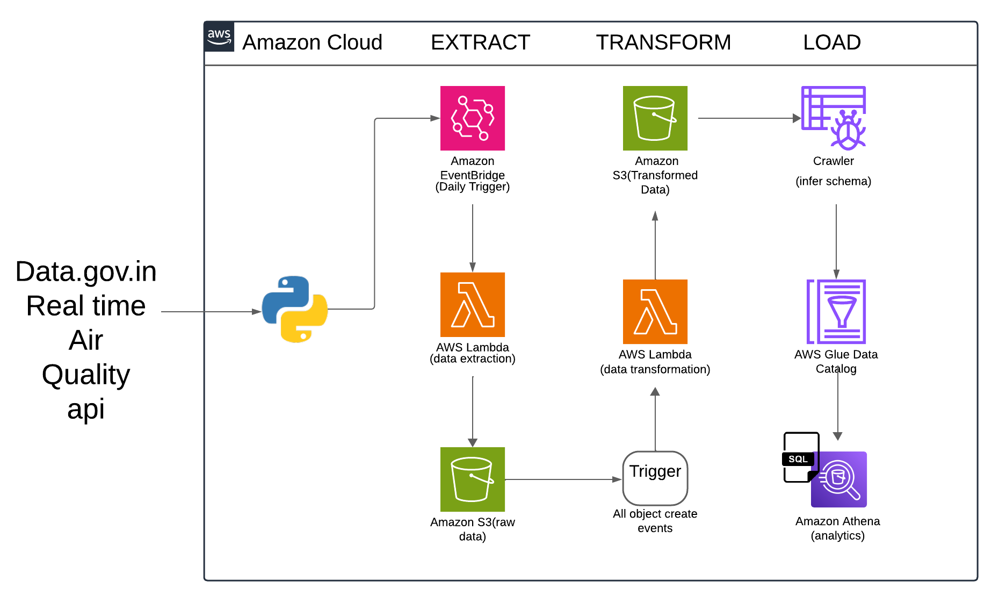

# Maharashtra-Real-Time-Air-Quality-ETL-Project
A serverless data pipeline that extracts real-time air quality data, transforms it using Python, and loads it into AWS Glue for querying via Amazon Athena.

## ✨ Features
- Serverless architecture using AWS Lambda
- Real-time air quality data from Data.gov.in
- Daily automated ETL with AWS EventBridge
- Data transformation and cleaning using Python
- Queryable structured output using Athena

## 🎯 Objective
To collect, transform, and analyze real-time air quality data of Indian state Maharashtra or it can be done for across Indian cities also using a scalable, fully managed AWS solution.

## 🏗️ Architecture

> The pipeline consists of two Lambda functions for extraction and transformation, with data moving through S3 and AWS Glue to Athena.

## 🛠️ Tech Stack
- **Language**: Python
- **Cloud**: AWS
- **Data Source**:  https://www.data.gov.in/resource/real-time-air-quality-index-various-locations
- **Services**: Lambda, S3, Glue, Athena, EventBridge, S3 trigger(Load Lambda function)

## 🔁 ETL Pipeline

### 📥 Extract
- AWS Lambda triggered by EventBridge on hourly basis(maharastra_air_quality_extract function)
- Fetches data from Data.gov.in API
- Saves raw JSON to Amazon S3

### 🔧 Transform
- S3 event triggers another Lambda(maharastra_air_quality_load function)
- Cleans and enriches data like:
-  1.adding new columns like range, aqi_value, air_quality, data and time column.
-  2.pivot_time_city: To analyze how AQI values vary hourly across different cities.
-  3.pivot_date_city: To analyze day-by-day AQI variations per city.
-  4.pivot_city_pollutant: To analyze which pollutants dominate in which cities based on AQI contribution.
- Outputs structured CSV/Parquet to transformed S3 location

### 📤 Load
- AWS Glue Crawler infers schema from transformed data
- Data is cataloged in Glue
- Amazon Athena is used for SQL queries

## Modules used

| Module        | Description                                                                |
| ------------- | -------------------------------------------------------------------------- |
| `boto3`       | AWS SDK for Python — used to upload processed and pivoted data files to S3 |
| `json`        | Built-in module to handle and parse JSON responses from APIs               |
| `requests`    | Used to fetch air quality data from external APIs                          |
| `datetime`    | Built-in module to handle timestamps, extract dates and hours              |
| `pandas`      | Core library for data analysis, transformation, and pivot table generation |
| `io.StringIO` | Built-in module to handle in-memory CSV string conversion before uploading |

## IAM Roles required for lambda functions:
### 1. maharastra_air_quality_extract function
####       1.AmazonS3FullAccess
####       2.AWSLambdaRole

### 2. maharastra_air_quality_load_function
####       1.AmazonS3FullAccess
####       2.AWSLambdaRole

# project screenshots

